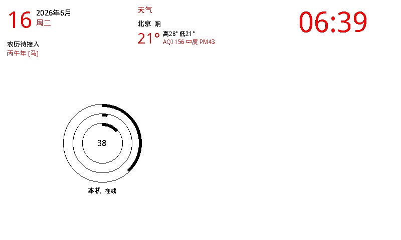

# EPD Status Dashboard

一块挂墙上的墨水屏小看板。它能显示你的**服务器健康状态、待办清单、天气、农历、时钟**等等——像个永远亮着、不刺眼、不耗电的"信息相框"。

显示什么、放在屏幕哪个位置、多大，全部由你在一个配置文件里说了算。每一块信息都是一个独立的"积木"（我们叫它 **Widget**），你想拼成什么样都行。



---

## 一、先搞懂：这套东西到底是怎么转起来的？

这块墨水屏**自己不会上网、不会算东西**。它就是一块"傻屏幕"，只会干一件事：**别人通过蓝牙发一张图片给它，它就把那张图显示出来。**

所以要让它显示"北京 22°、CPU 占用 60%、今天 3 个待办"，背后其实分了三步、可能由三个不同的角色完成：

```text
①  画图的人          ②  送图的人              ③  显示的屏
┌──────────────┐     ┌──────────────┐        ┌──────────────┐
│  渲染端       │     │  蓝牙网关     │        │  墨水屏       │
│              │     │              │  蓝牙   │              │
│ 收集数据，   │HTTP │ 下载这张图，  │ ─────> │ 收到图，     │
│ 画成一张     │────>│ 翻译成屏幕能  │        │ 刷新显示     │
│ 800x480 图片 │     │ 看懂的格式，  │        │              │
│              │     │ 蓝牙发过去    │        │              │
└──────────────┘     └──────────────┘        └──────────────┘
```

**用大白话讲这三个角色：**

| 角色 | 它干的活 | 为什么需要它 | 谁来当 |
|---|---|---|---|
| **① 渲染端**（画图的） | 去采集服务器状态、查天气、读 Notion 待办，然后把这些信息**画成一张图片**，放在一个网址上等人来取 | 屏幕自己不会算这些，得有人先把图画好 | 任何一台常开的电脑/服务器（云 VPS、树莓派、你的台式机都行） |
| **② 蓝牙网关**（送图的） | 每隔几分钟去渲染端**下载那张图**，把它翻译成墨水屏认识的三色格式，再通过**蓝牙**发给屏幕 | 云服务器没有蓝牙，发不了；必须有一台带蓝牙、且离屏幕近的机器来"递话" | 一台带蓝牙、离屏幕近的机器（树莓派 / 你的 Windows 台式机） |
| **③ 墨水屏**（显示的） | 收到图就刷新显示，然后断电也能一直留着画面 | 这就是你买的那块硬件 | UC8179 三色墨水屏 + nRF52811 蓝牙芯片 |

> **关键点**：①画图 和 ②送图 可以是**同一台机器**（比如一个树莓派全包了），也可以**分开**（比如云服务器画图、树莓派只负责送图）。怎么分配看你手头有什么硬件——下面"三种玩法"会讲。

---

## 二、为什么要分成"渲染端"和"蓝牙网关"两个角色？

很多人第一反应是"为什么不让屏幕自己上网取数据？"——因为这块屏的蓝牙芯片很弱，只够接收一张现成的图，没法跑天气 API、SSH 连服务器这些复杂活。

那"为什么不在带蓝牙的电脑上直接画图、直接发？"——也可以！这就是**树莓派一体机**玩法。但如果你想用云服务器 7×24 小时画图（台式机可能会关机），就需要：云服务器负责画（它在线最稳），树莓派只负责把图蓝牙送出去（它离屏幕近、有蓝牙）。

所以**这两个角色是按"能力"拆的**：
- 画图需要**算力 + 联网 + 一直在线** → 谁满足谁来当渲染端
- 送图需要**蓝牙 + 离屏幕近** → 谁满足谁来当网关

---

## 三、三种玩法，按你的硬件挑一个

| 玩法 | ①画图的 | ②送图的 | 什么情况下选它 |
|---|---|---|---|
| **A. 树莓派一体机**（最简单） | 树莓派 | 同一个树莓派 | 你有树莓派，想一台机器全搞定 |
| **B. 云服务器 + 树莓派** | 云 VPS | 树莓派 | 想让云服务器 7×24 画图，树莓派只蓝牙送图 |
| **C. 云服务器 + Windows 台式机** | 云 VPS | Windows 台式机 | 没树莓派，但有台常开的 Windows 电脑带蓝牙 |

三种玩法用的是**同一套代码**，区别只是：哪台机器跑"画图"程序，哪台机器跑"送图"程序。

---

## 四、上手：先把图画出来看看（任何电脑都能试）

不用管蓝牙、不用管屏幕，先在任意一台电脑上把图渲染出来，确认效果：

```bash
git clone https://github.com/zhangyu0806/epd-status-dashboard.git
cd epd-status-dashboard
python3 -m venv .venv
. .venv/bin/activate
pip install -r requirements-render.txt

cp config.example-minimal.yaml config.yaml      # 用极简入门配置
python generate.py --config config.yaml --output ./status.png
```

打开生成的 `status.png` 看效果。这个极简配置不需要任何账号，只显示：本机服务器状态 + 天气 + 时钟 + 农历。

想看总共有哪些积木可以用：

```bash
python generate.py --list-widgets
```

确认能画图了，再往下选玩法部署。

---

## 五、Widget（积木）怎么摆？—— 把屏幕想成切蛋糕

整块屏幕（800×480）就像一块大蛋糕，你通过**一层层地切**，把它分成一个个小格子，每个格子里放一个积木。

这个"怎么切"写在配置文件的 `layout` 段里。看个例子，配合右边注释理解：

```yaml
layout:
  direction: column        # 先竖着切（上下分层）
  padding: 8               # 整块蛋糕四周留 8px 空白
  gap: 6                   # 每层之间留 6px 缝隙
  children:
    # 第一层：顶部一条横栏，固定高 96 像素
    - px: 96
      direction: row       # 这一层里横着切（左右分）
      children:
        - {size: 1, widget: lunar_calendar}   # 左边放农历
        - {size: 1, widget: weather}          # 右边放天气，两个一样宽
    # 第二层：剩下的所有空间
    - size: 1
      direction: row       # 横着切成左右两半
      children:
        - {size: 1, widget: server_rings}     # 左半：服务器圆环
        - {size: 1, widget: notion_todo}      # 右半：待办清单
```

**切蛋糕的三条规则（很简单）：**

| 写法 | 意思 |
|---|---|
| `direction: column` | 这一块**上下**切分 |
| `direction: row` | 这一块**左右**切分 |
| `px: 96` | 这一格**固定**占 96 像素（适合顶栏、底栏这种高度固定的） |
| `size: 1` / `size: 2` | 这一格占**剩余空间的比例**。两个都是 1 就平分；一个 2 一个 1 就是 2:1 |
| `widget: 名字` | 这个格子里放哪个积木（名字见下面的积木清单） |
| `options: {...}` | 给这个积木的额外设置（标题、颜色、字号等） |

**想改布局？** 就改这棵树：
- 想把待办换到左边、服务器换到右边 → 把那两行 `widget:` 对调。
- 想让待办占更大 → 把它的 `size: 1` 改成 `size: 2`。
- 想加一个时钟 → 在某层 `children` 里加一行 `- {size: 1, widget: clock}`。
- 想去掉天气 → 删掉 `weather` 那一行。

改完重新跑一次 `python generate.py` 就能看到新效果。

---

## 六、有哪些积木可以用？

| 积木名（widget） | 显示什么 | 常用设置（options） |
|---|---|---|
| `server_rings` | 服务器同心圆环，一台服务器一个圈（内圈→外圈 = 磁盘/CPU/内存），中心显示内存占用% | `title`、`columns`（一行几个）、`only`（只显示某几台） |
| `sub2api_panel` | sub2api 服务状态 + Pro20X 额度条 | `title`、`quota_title` |
| `notion_todo` | 从 Notion 数据库拉来的待办清单 | `title`、`show_due`、`row_height` |
| `weather` | 城市天气（温度/状况/最高最低/空气质量） | `title` |
| `lunar_calendar` | 阳历日期 + 星期 + 农历 + 干支生肖 | `day_size` |
| `clock` | 大字时钟 | `time_format`、`size`、`show_date` |
| `countdown` | 倒数日（距离某天还有几天） | `date`、`label` |
| `quote` | 每日一句（按日期轮换） | `quotes`、`size` |
| `text` | 你自己写的任意文字 | `content`、`align`、`size`、`color` |
| `panel` | 带边框标题的卡片，里面再包一个积木 | `title`、`child` |
| `rings_legend` | 圆环图例（解释内外圈是什么） | `labels` |

某个积木没配数据时会显示"未配置"，不会让整张图崩掉。

---

## 七、怎么接入真实数据？

### 服务器监控

```yaml
thresholds: {cpu: 85, mem: 85, disk: 90}   # 超过这些百分比，对应的圈变红报警
servers:
  - {name: "本机", host: "local", disk_path: "/"}           # 监控渲染端这台机器自己
  - {name: "VPS",  host: "root@203.0.113.10", disk_path: "/"}  # 监控远程机器
```

`host: local` 是监控画图这台机器自己；远程机器要先配好 **SSH 免密登录**（渲染端能 `ssh root@xxx` 不输密码），否则取不到数据。

### 天气（免费、不用注册）

用的是 [Open-Meteo](https://open-meteo.com/)，免费免 Key：

```yaml
weather:
  enabled: true
  city: "北京"          # 写城市名自动定位
  air_quality: true     # 显示空气质量 AQI 和 PM2.5
```

### Notion 待办

1. 去 https://www.notion.so/my-integrations 创建一个 Integration，拿到 token。
2. 打开你的待办数据库页面 → 右上角 `⋯` → `Connections` → 把刚才的 Integration 加进去（**这步必须做**，不然读不到）。
3. 复制数据库 ID（页面网址里 `notion.so/` 后面、`?v=` 前面那一长串）。
4. 配置：

```yaml
notion:
  enabled: true
  token_env: "NOTION_TOKEN"     # token 放环境变量，别直接写文件里
  database_id: "你的数据库ID"
  title_property: "任务名称"
  status_property: "Status"
  done_values: ["Done", "完成"]
  hide_done: true
  limit: 14
```

token 怎么给：用 systemd 跑就放 `EnvironmentFile`（见下面部署示例）；手动跑就 `export NOTION_TOKEN=ntn_xxx`。

### 字体（中文显示成方块时看这里）

```yaml
dashboard:
  font_path: "/path/to/字体.ttf"   # 留空会自动找系统中文字体
```

Linux 装中文字体：`sudo apt install fonts-wqy-zenhei`。

---

## 八、正式部署（让它自动每隔几分钟刷新）

### 玩法 A：树莓派一体机（画图 + 送图都在树莓派上）

```bash
# 1. 把代码放到 /opt
sudo mkdir -p /opt/epd-status-dashboard
sudo cp -a . /opt/epd-status-dashboard/
cd /opt/epd-status-dashboard
python3 -m venv .venv && . .venv/bin/activate
pip install -r requirements-render.txt -r requirements-uploader.txt
cp config.example-minimal.yaml config.yaml      # 按需编辑

# 2. 启动"画图"服务（每 3 分钟出图 + 一个本机网页放图）
sudo cp systemd/epd-status-dashboard.service /etc/systemd/system/
sudo cp systemd/epd-status-dashboard.timer /etc/systemd/system/
sudo cp systemd/epd-status-dashboard-http.service /etc/systemd/system/
sudo systemctl daemon-reload
sudo systemctl enable --now epd-status-dashboard.timer epd-status-dashboard-http.service

# 3. 启动"送图"服务（从本机下载图，蓝牙发给屏幕）
sudo apt install -y bluetooth bluez
sudo cp systemd/epd-uploader.env.example /etc/epd-uploader.env   # 默认已指向本机 127.0.0.1
sudo cp systemd/epd-uploader.service /etc/systemd/system/
sudo systemctl daemon-reload
sudo systemctl enable --now epd-uploader.service

journalctl -u epd-uploader.service -f       # 看送图日志
```

### 玩法 B：云服务器画图 + 树莓派送图

**云服务器上**（只画图）：跑上面 A 的第 1、2 步（不装 uploader、不跑送图服务），然后放行端口：

```bash
sudo iptables -I INPUT 1 -p tcp --dport 8088 -j ACCEPT
sudo netfilter-persistent save
curl -I http://localhost:8088/status.png      # 确认图能访问
```

**树莓派上**（只送图）：

```bash
sudo mkdir -p /opt/epd-status-dashboard
sudo cp -a . /opt/epd-status-dashboard/
cd /opt/epd-status-dashboard
python3 -m venv .venv && . .venv/bin/activate
pip install -r requirements-uploader.txt
sudo apt install -y bluetooth bluez

sudo cp systemd/epd-uploader.env.example /etc/epd-uploader.env
sudo sed -i 's#127.0.0.1#你的云服务器IP#' /etc/epd-uploader.env   # 改成去云服务器取图
sudo cp systemd/epd-uploader.service /etc/systemd/system/
sudo systemctl daemon-reload
sudo systemctl enable --now epd-uploader.service
```

### 玩法 C：云服务器画图 + Windows 台式机送图

云服务器端同玩法 B。Windows 送图端见下一节。

---

## 九、Windows 台式机当"送图网关"

### 推荐：装成开机自启

把 Windows 上传包解压，PowerShell 进入该目录：

```powershell
Set-ExecutionPolicy -Scope CurrentUser RemoteSigned
.\install-windows-autostart.ps1
```

它会把程序装到 `%LOCALAPPDATA%\EpdStatusDashboard`、建好 Python 环境、注册一个开机自启的计划任务。默认每 7 分钟（420 秒）一轮：先确认云服务器那张图更新了，再下载、蓝牙送屏，避免反复刷屏。

看日志：

```powershell
Get-Content -Wait "$env:LOCALAPPDATA\EpdStatusDashboard\logs\epd-upload.log"
```

### 手动测一次（任何系统都通用）

送图程序是跨平台的（Linux/树莓派/Windows/Mac 都能跑）：

```bash
pip install -r requirements-uploader.txt

python windows_epd_upload.py --scan-only                                   # 只扫描附近的蓝牙屏
python windows_epd_upload.py --image-url http://服务器IP:8088/status.png      # 送一次图
python windows_epd_upload.py --image-url http://服务器IP:8088/status.png --daemon   # 常驻循环送
```

看到 `upload complete; waiting for EPD refresh` 就说明发成功了，屏幕会开始刷新（三色屏刷新慢，要等几十秒）。

> 脚本名虽然带 `windows`，但它其实跨平台。树莓派/Linux 上用 `systemd/epd-uploader.service` 常驻跑（见玩法 A/B）。

---

## 十、想加一个全新的积木？

每个积木就是一个继承 `Widget` 的小类，30 行就能写一个：

```python
# epd_dashboard/widgets/my_widget.py
from ..core import BLACK, Rect, RenderContext, Widget, load_font, register

@register("my_widget")            # 配置里就能写 widget: my_widget
class MyWidget(Widget):
    def render(self, ctx: RenderContext, rect: Rect) -> None:
        text = str(self.opt("text", "你好"))
        ctx.draw.text((rect.x + 4, rect.y + 4), text, fill=BLACK, font=load_font(16))
```

写完在 `epd_dashboard/widgets/__init__.py` 里 import 一下让它注册。需要联网取数据的积木，把取数逻辑放进 `epd_dashboard/collectors/`，用 `ctx.shared("key", producer)` 缓存，保证一次渲染只取一次数据。

---

## 十一、一些要注意的坑

- 云服务器没有蓝牙，**必须**有树莓派/Windows/本地小主机当送图网关。
- 远程服务器监控要先配 SSH 免密，否则取不到数据。
- 中文显示成方块 → 装中文字体（见第七节）。
- 刷新间隔最小强制 300 秒，刷太勤会伤墨水屏。
- 这块屏只认黑/白/红三色，框架已自动处理，你写积木不用管。
- 屏幕断电后画面还在（墨水屏特性），换电池或停服务期间也不会变白。

---

## 十二、电量显示说明

墨水屏原生固件能显示电量，是因为它自己读电压。本项目走的是"整图上传"路线，不会触发固件那套电量绘制。送图程序支持读标准蓝牙电量服务，但默认固件没开放这个，需要按 `firmware/EPD-nRF5-battery-service.md` 改固件才行。没电了手动换电池即可。

---

## 十三、改进路线图（欢迎 PR）

- [ ] 补 `docs/preview.png` 实拍图 + 一段传屏 GIF
- [ ] Web 可视化配置界面（拖拽布局，免手写 YAML）
- [ ] 更多积木：日历事件、RSS、GitHub 通知、股价/汇率
- [ ] 多屏支持（一份渲染服务驱动多块不同尺寸的屏）
- [ ] 适配更多屏型（黑白屏、其他分辨率）
- [ ] 配置热重载（改完自动重画，不用等定时器）
- [ ] Docker 一键起渲染端
- [ ] `generate.py --doctor` 自检（字体/依赖/SSH/数据源连通性）

---

## 目录结构

```text
epd-status-dashboard/
  generate.py                 # 【画图入口】读配置 -> status.png + status.json
  config.example-minimal.yaml # 极简入门配置（无需任何账号）
  config.example.yaml         # 完整配置模板（含 sub2api / Notion）
  epd_dashboard/
    core/                     # 颜色/字体/几何/布局树/积木基类/渲染编排
    collectors/               # 服务器 / sub2api / Notion / 天气 的数据采集
    widgets/                  # 11 个内置积木
  windows_epd_upload.py       # 【送图程序】下载图片 + 蓝牙传屏（跨平台）
  uploader_run.sh             # 送图程序的启动脚本（systemd 调用）
  oc24_render_once.sh         # 画图的启动脚本（systemd 调用）
  systemd/                    # 各种 systemd 服务文件 + env 模板
  install-windows-autostart.ps1   # Windows 开机自启安装器
  firmware/                   # 固件相关说明
  requirements-render.txt     # 画图端依赖
  requirements-uploader.txt   # 送图端依赖（跨平台）
```

---

## 致谢

- 屏幕固件：[EPD-nRF5](https://github.com/tsl0922/EPD-nRF5)
- 天气数据：[Open-Meteo](https://open-meteo.com/)（免费免 Key）
